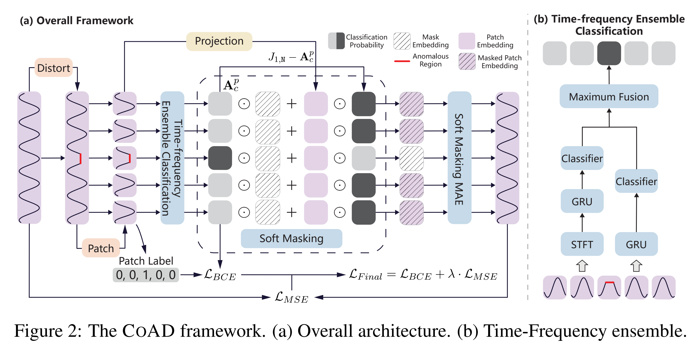
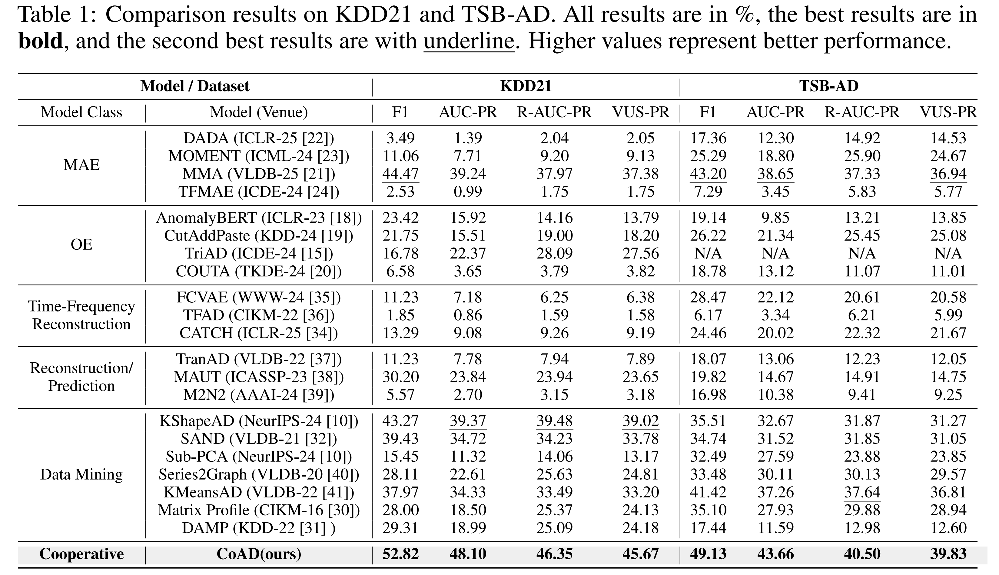
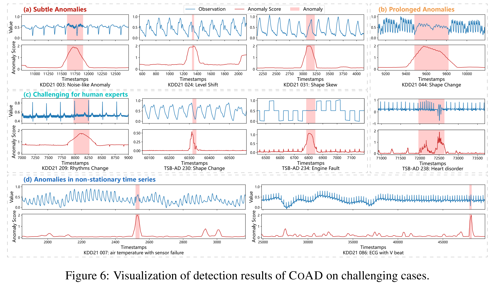

<h1 align="center">CoAD</h1>
<h2 align="center">🌉 Bridging Classification and Reconstruction: Cooperative Time Series Anomaly Detection</h2>

## Table of Contents ##
- [🏄‍ Overall Framework](#overview)
- [📄 Main Results](#main-results)
- [📊 Case Studies](#case-studies)
- [⚙️ Setup](#setup)
- [🗄️ Prepare datasets](#prepare-datasets)
- [🔁 Reproduce the main results](#reproduce-the-main-results)
- [🔁 Reproduce the baseline results](#reproduce-the-baseline-results)
- [🔁 Reproduce the ablation study results](#reproduce-the-ablation-study-results)
- [🔁 Reproduce the parameter study results](#reproduce-the-parameter-study-results)
- [📚 References](#references)


<h2 id="overview">🏄‍ Overall Framework </h2>
<p style="text-align: center;">

</p>

<h2 id="main-results">📄 Main Results </h2>
Evaluation results on reliable datasets (KDD21 [1] and TSB-AD [2]) using rigorous evaluation protocols [2].

<p style="text-align: center;">

</p>

<h2 id="case-studies">📊 Case Studies </h2>
Visualizes the detection results of COAD on several challenging cases.

<p style="text-align: center;">

</p>


<h2 id="setup">⚙️ Setup </h2>
Installation

```
conda create -n CoAD python=3.11
conda activate CoAD
pip install -r requirements.txt
```
<h2 id="prepare-datasets">🗄️ Prepare datasets </h2>

Download the dataset from the anonymous link [dataset](https://d.kuku.lu/pfj2vscrj) and extract it to the `dataset` folder.
```
├─dataset
├───TSB-AD
│   ├───raw
│   │   ├───001_NAB_id_1_Facility_tr_1007_1st_2014.csv
│   │   ├───...
├───UCR(KDD21)
│   ├───processed
│   │   ├───train
│   │   ├───test
│   │   ├───label
│   ├───all_period.csv
```

<h2 id="reproduce-the-main-results">🔁 Reproduce the main results </h2>

```shell
sh runners/run_all_CoAD.sh
```


<h2 id="reproduce-the-baseline-results">🔁 Reproduce the baseline results </h2>

```shell
sh runners/run_deep_baseline.sh
sh runners/run_dm_baseline.sh
```

<h2 id="reproduce-the-ablation-study-results">🔁 Reproduce the ablation study results </h2>

The details of the ablation versions are shown in the **runners/run_ablation_CoAD.sh** file.
```shell
sh runners/run_ablation_CoAD.sh
```

<h2 id="reproduce-the-parameter-study-results">🔁 Reproduce the parameter study results </h2>

```shell
sh runners/parameter.sh
```

<h2 id="references">📚 References </h2>

1. E. Keogh, “Multidataset time series anomaly detection competition,” 2021, https://compete.hexagon-ml.com/practice/competition/39/.

2. Q. Liu and J. Paparrizos, “The elephant in the room: Towards a reliable time-series anomaly detection benchmark,” in The 38th Conference on Neural Information Processing Systems Datasets and Benchmarks Track, 2024

